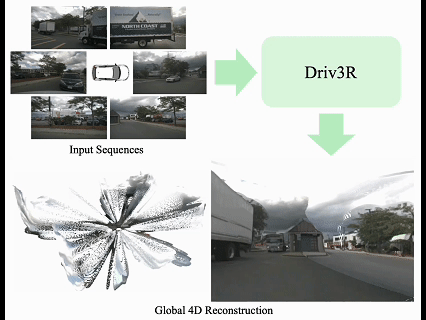
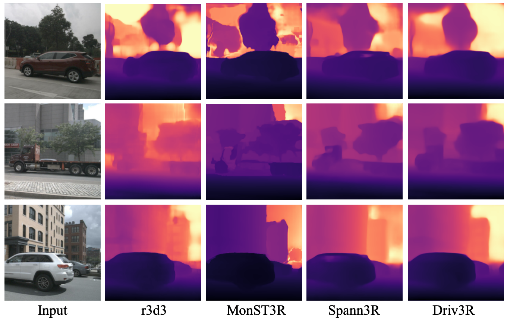

# Driv3R: Learning Dense 4D Reconstruction for Autonomous Driving

### [Paper]() | [Project Page](https://wzzheng.net/Driv3R)

> [Xin Fei](https://github.com/Barrybarry-Smith)*, [Wenzhao Zheng](https://wzzheng.net/)$\dagger$, [Yueqi Duan](https://duanyueqi.github.io/), [Wei Zhan](https://zhanwei.site/), [Masayoshi Tomizuka](https://me.berkeley.edu/people/masayoshi-tomizuka/), [Kurt Keutzer](https://people.eecs.berkeley.edu/~keutzer/), [Jiwen Lu](http://ivg.au.tsinghua.edu.cn/Jiwen_Lu/)

Tsinghua University, UC Berkeley

\*Work done during an internship at UC Berkeley, $\dagger$ Project leader


For real-time 4D reconstruction in autonomous driving, existing DUSt3R-based methods fall short due to inaccurate modeling of fast-moving dynamic objects and reliance on computationally expensive global alignment processes. In comparison, our Driv3R predicts per-frame pointmaps in the global consistent coordinate system in a optimization-free manner, and can accurately reconstruct fast-moving objects on large-scale scenes with **15x faster inference speed** compared to methods requiring global alignment.

## News
- **[2024/12/9]** Code release.
- **[2024/12/9]** Paper released on [arXiv]().

## Demo
<div style="text-align: center;">
  
</div>

## Visualization


## Pipeline


**Pipeline of Driv3R:** Given multi-view input sequences, we construct a sensor-wise memory pool for temporal and spatial information interactions. After obtaining per-frame pointmaps, 4D Flow Predictor identifies the dynamic objects within the scene. Finally, we adopt a optimization-free multi-view alignment strategy to formulate the 4D global point cloud in the world coordinate system.

## Getting Started

### installation
```bash
conda create -n driv3r python=3.11 cmake=3.14.0
conda activate driv3r 
conda install pytorch torchvision pytorch-cuda=12.1 -c pytorch -c nvidia 
```
Then, install the packages as shown in requirement.txt.
Also, please compile the external sam2 package in ./third_party/sam2.

### Data Preparation

1. Please download the nuScenes full dataset with the following structure:
```
├── datasets/nuscenes
│   ├── maps
│   ├── samples
│   ├── v1.0-test
│   ├── v1.0-trainval
```
Then, run the following command to generate *train_metas.pkl* and *val_metas.pkl*.
```bash
python preprocess/nuscenes.py
```
**Note:** If you wish to apply our model to other AD datasets, please add them under ./driv3r/datasets. We are currently in the process of integrating the Waymo, KITTI, and DDAD datasets into our codebase and will update it as soon as the integration is complete.

2. **For training only:** To train the Driv3R model, you will need the inference results from the [R3D3](https://github.com/SysCV/r3d3) model as supervision. Since the virtual environment of R3D3 is not compatible with CUDA 12.1, we strongly recommend completing this step in advance. After obtaining the depth predictions, please modify the *depth_root* parameter in *script/train.sh*.

### Checkpoint Download

To download all checkpoints required for Driv3R, please run the following command:
```bash
sh script/download.sh
```

### Train, Eval and Visualization

1. To train the Driv3R model on NuScenes dataset, please simply run:
```bash
sh script/train.sh
```
Please modify the *nproc_per_node* and *batch_size* according to your GPUs.

2. To generate the complete 4D point cloud in the global coordinate system, please run:
```bash
sh script/vis.sh
```
Note that you can modify *sequence_length* to control the length of the input sequences.

3. To evaluate the performance of your pretrained model, please run:
```bash
sh script/eval.sh
```

## Citation

If you find this project helpful, please consider citing the following paper:
```

```